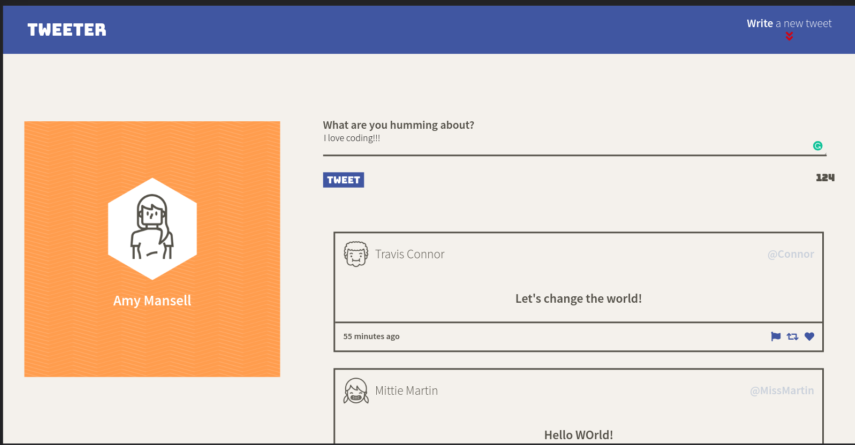
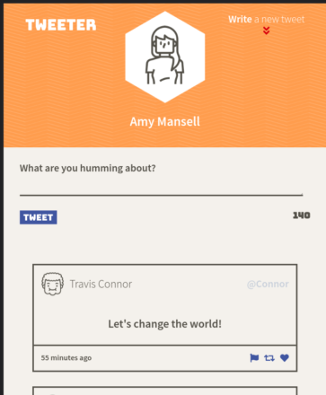
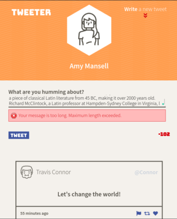

# Tweeter Project

Tweeter is a simple, single-page old Twitter clone.

I forked the starter code for the project and cloned it to my repository, then I built upon it to practice my HTML, CSS, JS, jQuery and AJAX front-end skills, and my Node, Express and MongoDB back-end skills.

## Getting Started

1. Fork this repository, then clone your fork of this repository.
2. Install dependencies using the `npm install` command.
3. Start the web server using the `npm run local` command. The app will be served at <http://localhost:8080/>.
4. Go to <http://localhost:8080/> in your browser.

## Dependencies

- Express
- Node 5.10.x or above
- Body-parser
- Chance
- Timeago

## Screenshots
### Desktop

### Mobile

### Error message

